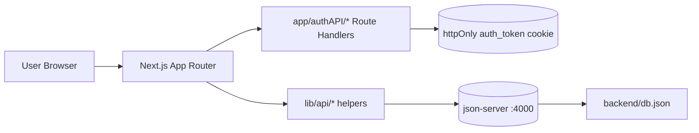

# Architecture Overview

This project is a Next.js App Router admin dashboard with a mock API backend for development.

## High-level flow

## Main modules

- `app/(dashboard)/dashboard/layout.tsx` — server-side auth gate before rendering dashboard pages.
- `app/components/auth/Protected.tsx` — client-side protection using `/authAPI/me` session check.
- `app/authAPI/*` — login/register/logout/me and 2FA route handlers.
- `lib/api/config.ts` — shared `apiFetch` wrapper.
- `backend/db.json` — mock data source for local development.

## Production note

Current backend data source is `json-server` (`backend/db.json`) and is intentionally for local/demo usage.
For production portfolio upgrades, migrate API routes to a real DB (PostgreSQL/MySQL/MongoDB) and keep the same API contract.

## Optional screenshots checklist

Create a `docs/screenshots/` folder and add:

- `login.png`
- `dashboard.png`
- `products.png`
- `settings.png`

Then reference those images from `README.md`.
